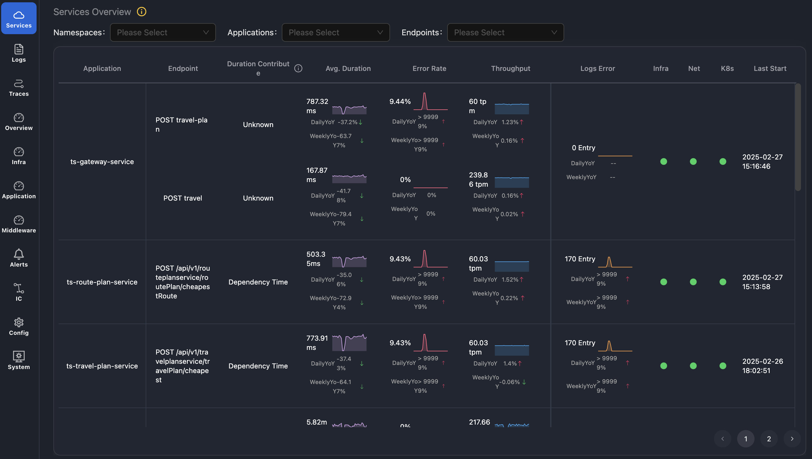
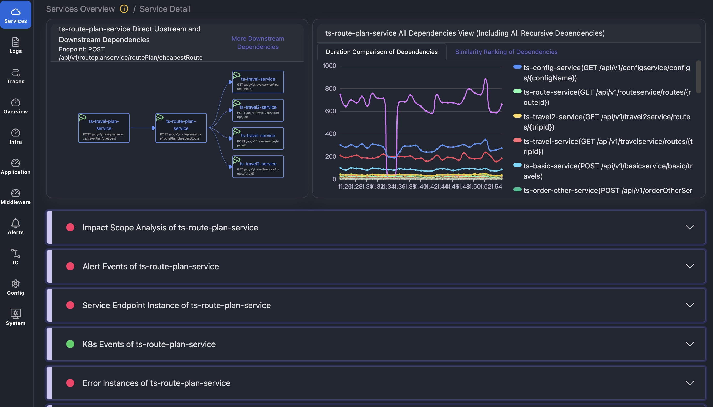

# APO - The Intelligent Observability Platform
Visit [autopilotobservability.com](https://autopilotobservability.com) for more details.
## 🚀 Introduction 
**APO (AutoPilot Observability)** redefines modern observability by seamlessly combining AI and deep system insights. Powered by state-of-the-art Large Language Models (LLMs), APO empowers teams to decode complex system behaviors, rapidly pinpoint root causes, and automate diagnostic workflows. APO’s AI agentic workflows with designed data plane put you in control, enabling custom automated diagnostics that fit your unique needs.

APO display the following Highlights:

+ **Agentic Workflows for Observability**: Low-code orchestration that transforms your expertise into the dynamic core powering the intelligent agents.
+ **LLM-native data plane**: Designed data plane for LLM and deeply integrated with AI Agent.
+ **Seamless Data Source Integration**: Supports frictionless connection to existing data sources, empowering users to leverage our revolutionary data plane without any system modifications.
+ **Full-Stack Coverage**: Monitor logs, traces, and metrics seamlessly across your entire technology stack for comprehensive observability.
+ **10X Cost-Effective:** Save operational costs through streamlined processes, intelligent data handling, and efficient resource allocation.

## ✨ Features
### Agentic Workflows for Observability
Low-code orchestration that transforms your expertise into the dynamic core powering the intelligent agents.

+ Design personalized AI agent for observability.
+ Build troubleshooting workflows with guided experience.
+ Customize automated diagnostic workflows.
+ Experience advanced cross-domain data correlation.

### **LLM-native data plane**
+ **API-centric service map**: APO provides granular visibility into API endpoints within applications, creating clear service dependency maps for specific business flows. Our intelligent similarity algorithms prevent topology sprawl by condensing similar nodes while preserving detailed information in tabular views. Navigate effortlessly between node details with intuitive click-through navigation.
+ **Anomaly events with cross-domain data correlation**: Anomaly events with cross-domain data correlation: Given that observability data is diverse in structure and massive in scale, directly feeding it into large models is impractical. APO’s innovative approach transforms varied data into anomaly events, correlating them with the service map while capturing essential contextual details. This enriched data stream enables precise anomaly detection and cross-domain correlation, empowering the system to uncover subtle issues and deliver deeper, actionable insights.

### Zero-Touch Tracing Agent Instrumentation
With OneAgent technology, APO supports the automatic instrumentation of multi-language OpenTelemetry agents across traditional and containerized environments, eliminating manual configuration overhead.

### All-in-One Observability Hub
Experience complete visibility with APO's unified platform, bringing together traces, metrics, logs, and events in one cohesive view.

### Rapid Fault Chain Analysis
APO's intelligent correlation of delay patterns, error rates, and log anomalies quickly surfaces relevant time windows for detailed investigation through logs and traces.

## 📊 Why APO?
| **Traditional Observability Tools** | **APO** |
| --- | --- |
| Data overload and manual analysis | Simplified, actionable insights |
| Limited automation and customization | Fully customizable, automated workflows |
| Complicated agent installatioin | Zero-touch tracing agent Instrumentation |
| Black-box AIOps with poor explainability | Transparent, explainable recommendations |
| Vendor lock-in | Open source and extensible design |

## 🔧 Getting Started
Begin your journey with APO [here](https://docs.autopilotobservability.com/Quick%20Start).

## 📘 Documentation
Explore our comprehensive guides [here](https://docs.autopilotobservability.com).

## 🌐 Contributing
APO is open source, and we welcome contributions! Whether it’s fixing bugs, adding new features, or improving documentation, your input is valuable. Here’s how you can contribute:

1. Fork the repository.
2. Create a feature branch.
3. Commit your changes and push.
4. Submit a pull request with detailed explanations.

## 🛡️ License
APO is licensed under the [Apache-2.0 License](./LICENSE).

## ❤️ Join Our Community
Join the growing community of developers and engineers transforming observability with APO. Connect with us:

+ **Slack**: [Join our Slack](https://join.slack.com/t/autopilotob/shared_invite/zt-31hxqlvy8-6Z2oqLAhNGluUEf0UiJVeg)
+ **Github**: [GitHub](https://github.com/CloudDetail/apo)

Ready to transform your observability? Start with APO today! 🚀

