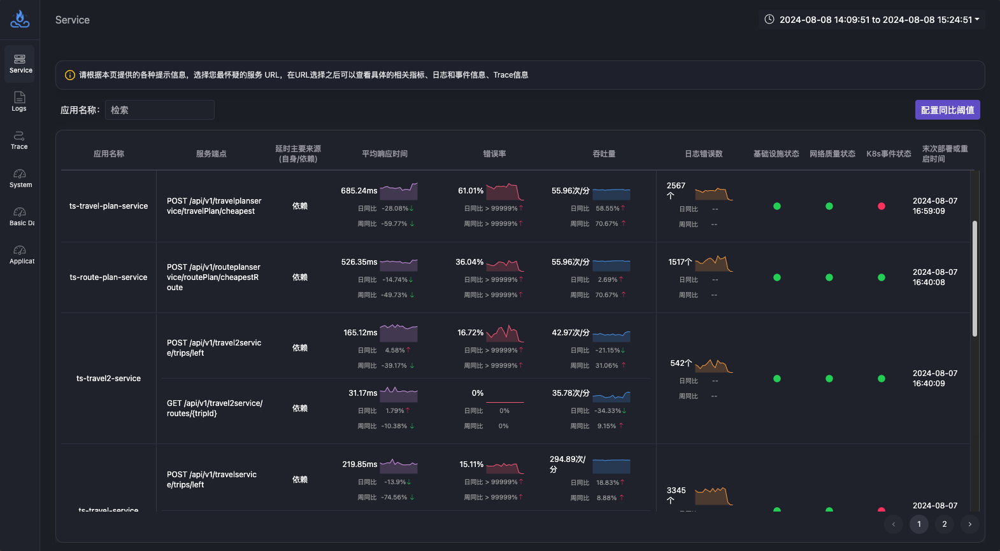
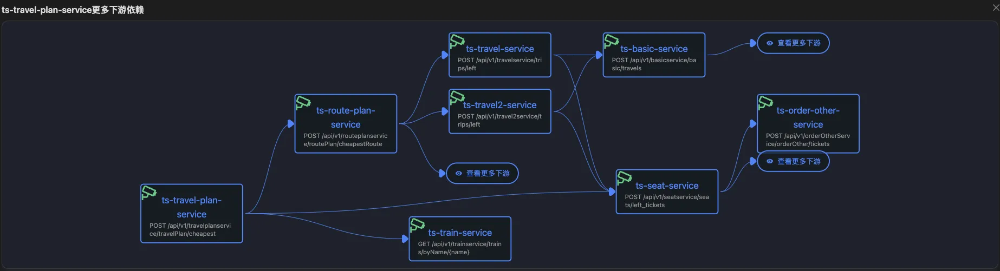
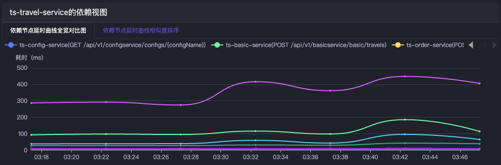
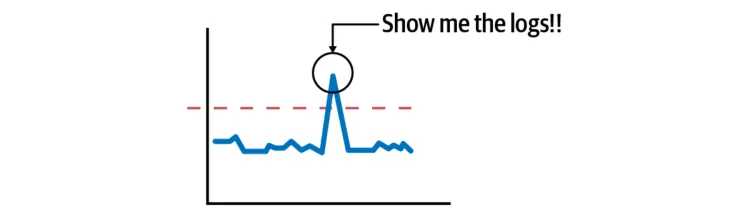
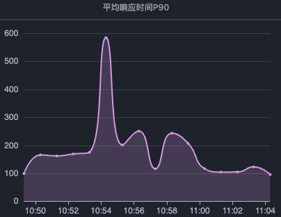
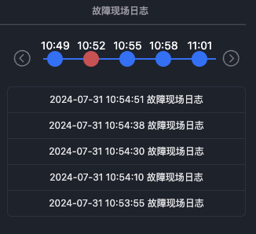
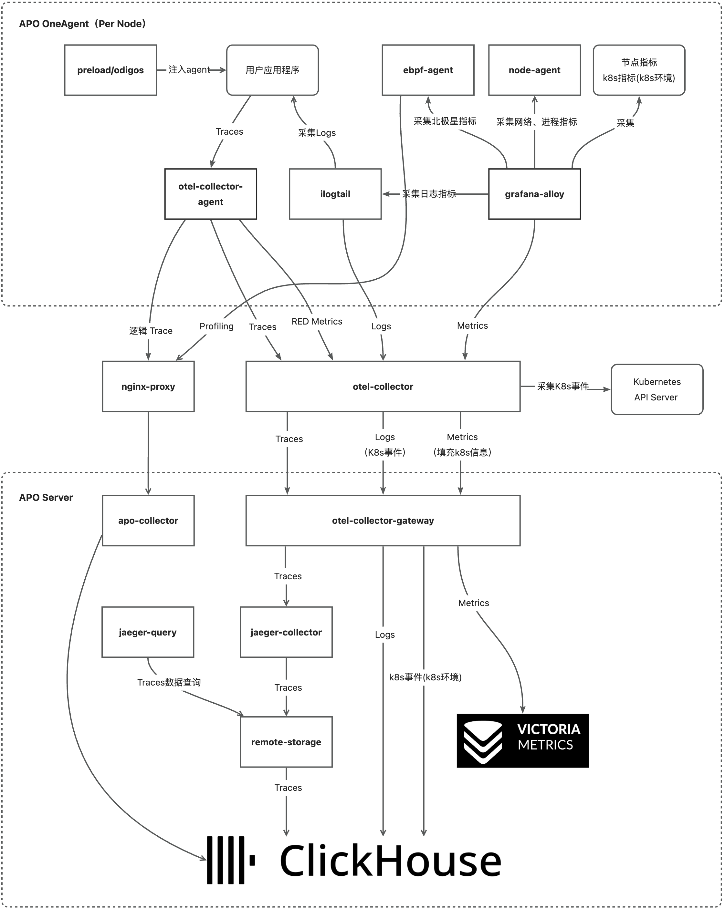

# AutoPilot Observability

 

欢迎访问 [在线 Demo](http://kindling.myddns.me:31553/) 体验产品。更多详情请查看[官方网站](https://apo.kindlingx.com)。
## AutoPilot Observability （简称APO）是什么？
- **开箱即用的可观测性平台**：APO 致力于提供一键安装、开箱即用的可观测性平台。APO 的 OneAgent 支持一键免配置安装 Tracing 探针，支持采集应用的故障现场日志、基础设施指标、应用和下游依赖的网络指标以及Kubernetes 事件，支持采集基于 eBPF 实现的[北极星因果指标](https://one.kindlingx.com)等数据。支持使用 Jaeger UI 查询 Tracing 数据，使用 PromQL 从 VictoriaMetrics 中查询 Metrics 数据并展示在 Grafana 上。
- **集成 eBPF 技术的 OpenTelemetry 发行版**：APO 整合了 OpenTelemetry 探针、otel-collector、Jaeger、ClickHouse 和 VictoriaMetrics，通过 OneAgent 技术支持在传统服务器和容器环境**自动安装**多语言的 OpenTelemetry 探针，减少用户配置工作。APO 创新性地将 eBPF 技术与 OpenTelemetry 生态融合，基于回溯采样算法，大大降低了数据的存储量。
- **基于 eBPF 的向导式排障产品**：AutoPilot 表示辅助用户定界定位故障原因。APO 提供了向导式辅助用户定界定位故障原因的界面，通过使用 APO 的 OneAgent 安装 OpenTelemetry 探针，OneAgent 能够分析环境故障，基于 eBPF 技术保留故障现场数据并展示在向导式排障界面上。eBPF 技术将向导式排障界面辅助用户在一个页面上完成故障原因的定界定位。
## 功能
### 自动安装 OpenTelemetry 探针，无需手动配置
通过 OneAgent 技术，支持在传统服务器和容器环境自动安装多语言的 OpenTelemetry 探针，减少用户配置工作。
### 一站式可观测性中心，一个页面完成故障定位
APO 集成了链路、指标、日志和事件等数据，能够一站式解决可观测性和故障定位的需求。

### 基于业务接口级别的拓扑
APO 将相同应用的不同接口调用区分开，清楚地给出应用执行某类业务时的调用关系，相同的应用节点可能会按照调用顺序出现多次。完整拓扑结构太复杂，没有实现拓扑本身应该具有的“地图导航”引导用户找到疑似故障节点的功能，因此 APO 利用延时曲线相似度来收缩相似度较低的节点，更多节点采用表格形式展示，避免拓扑过于复杂无法分析。当用户需要查看下游依赖节点时，可以点击节点名快速切换到不同节点的详情页面。

### 基于相似度算法排序高效识别级联的故障节点
在请求延时发生故障时，很多节点都会被级联的影响到，从传统告警中看是很多节点都有告警，在APO中，每个节点都会将其下游依赖的延时进行相似度曲线匹配，从而找到延时最相似的节点，最相似的节点是根因的可疑性更高，这里的下游依赖包括直接下游和下游依赖的依赖。

### 北极星因果指标主因判定算法
单纯的分析链路数据会留下很多盲区，难以快速判断延时升高时是自身导致还是依赖导致。[北极星因果指标](https://one.kindlingx.com)主因算法能够直接给出延时波动是由何种原因导致的，给出了故障原因的方向。例如下图给出的主因是对外网络调用延时变化导致了应用延时变化，结合网络延时指标可以判断出原因到底是网络延时变化还是下游节点延时变化。

利用eBPF技术采集的北极星因果指标直接给出故障定位方向，大致分为以下几个方向：

- 代码嵌套循环太多 
- 代码锁（垃圾回收、数据连接池争抢锁）
- 存储故障（磁盘故障）
- 下游依赖（中间件故障、服务故障）；需要根据网络指标排除网络质量故障
- CPU资源不足（其它程序抢占了CPU或者容器的limit配置不合理）
- 内存不足
### 快速找到故障链路和日志
根据延时、错误率和日志错误数量曲线可以快速定位故障可能发生时间点，从而查看时间点附近的日志或链路数据。

## 特点
### 保留故障现场的热数据，降低数据存储成本
故障现场的热数据 vs. 传统可观测性数据

- 对于异常（慢或者错）链路数据进行回溯采样，同时保留同时间段的日志（称之为**故障现场日志**），这些故障现场的数据在 APO 中被称之为热数据。回溯采样算法可以参考[算法论文](https://www.usenix.org/conference/nsdi23/presentation/zhang-lei)。
- 传统可观测性的保留方式称之为冷数据保留方式。

基于故障现场的热数据关联带来了不同数据之间跳转的极致流畅的体验。此外基于故障现场的热数据为未来优化存储、节约可观测性的成本带来了更多的可能性。

### 无惧数据膨胀，高效地在数据间关联跳转
APO 利用 eBPF 技术为原始数据生成并保存了“索引”数据，“索引“数据的大小明显小于原始数据，即使原始数据膨胀，APO 仍然能够通过查询索引数据快速给出可观测性数据结果。同时利用 eBPF 技术在内核中为不同类型的数据增加元信息标签，增强数据间的关联性，使用户在不同数据之间能够无缝跳转。

相比于其他可观测性方案，APO 在保存相同时间周期的数据时，占用更少的存储成本同时能够更快地给出数据结果。

### 事件指标化联动与更加直观的故障提示

- **日志错误数指标**：传统日志告警思路是根据日志内容为“Exception”或者“错误”进行告警，但有时日志会经常输出 Exception，业务却一切正常，如果按照日志内容告警，则会发生误告警。为了避免这个问题，APO 只匹配“Exception”或者“错误”日志，并将这些数量变成指标，如果该指标短时间飙升，可以起到日志告警的作用，提示用户程序执行过程有问题。
- **网络质量的事件化**：APO 基于 ping 包时延的方式来快速判断网络质量好坏，如果ping包延时超出预定阀值，APO页面上的网络质量状态会给出提示。
- **北极星因果指标：**[北极星因果指标](https://one.kindlingx.com)是一个应用执行业务过程中，各资源类型延时分布的指标化，基于延时分布能够利用算法判断延时的飙升是应用自身的问题还是依赖的问题。应用自身的问题也能给出故障原因的方向，是代码循环、锁还是资源不足等原因。
- **告警信息的关联**：传统告警信息与可观测性数据的联动很少，APO中将基础设施状态、网络质量状态、K8s 事件状态转换成示警信息，帮助用户在同一个界面中更快地判断故障原因。
## 快速开始
查看[安装文档](https://kindlingx.com/docs/APO%20%E5%90%91%E5%AF%BC%E5%BC%8F%E5%8F%AF%E8%A7%82%E6%B5%8B%E6%80%A7%E4%B8%AD%E5%BF%83/%E5%AE%89%E8%A3%85%E6%89%8B%E5%86%8C/%E5%BF%AB%E9%80%9F%E9%83%A8%E7%BD%B2/%E5%BF%AB%E9%80%9F%E5%BC%80%E5%A7%8B)快速开始使用APO。
## 文档
请查看[官方文档](https://kindlingx.com/docs/APO%20%E5%90%91%E5%AF%BC%E5%BC%8F%E5%8F%AF%E8%A7%82%E6%B5%8B%E6%80%A7%E4%B8%AD%E5%BF%83/%E4%BA%A7%E5%93%81%E4%BB%8B%E7%BB%8D).
## 架构
下图为 APO 组件的数据流图：

详细的架构与组件介绍请查看[架构文档](https://originx.kindlingx.com/docs/APO%20%E5%90%91%E5%AF%BC%E5%BC%8F%E5%8F%AF%E8%A7%82%E6%B5%8B%E6%80%A7%E4%B8%AD%E5%BF%83/%E6%8A%80%E6%9C%AF%E5%8E%9F%E7%90%86/%E6%9E%B6%E6%9E%84)。

## 社区 & 支持
如果您在使用过程中有任何问题，欢迎通过下方的方式联系我们：

- 微信

  
## License
[Apache License 2.0](https://github.com/CloudDetail/apo/blob/main/LICENSE)